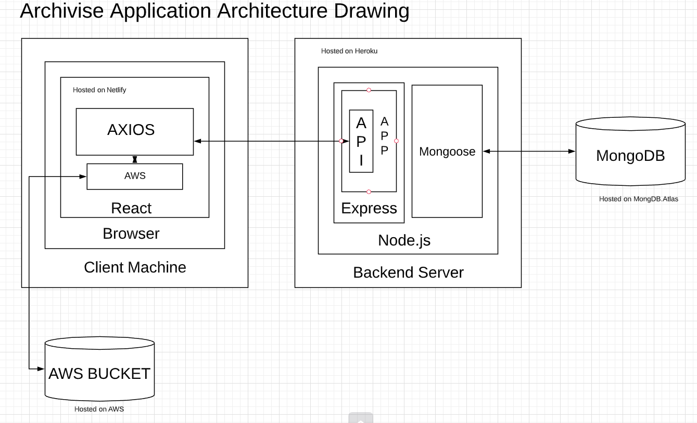

# Archivise for MacArthur Museum of Brisbane

  

### Rory Bell, Amber Emeny, Sarah Aldrich

---

### Contents

1. Purpose
2. Functionality
3. Target Audience
4. User Stories
5. Tech Stack
6. Third Party Packages
7. Application Architecture Diagram
8. Deployment
9. Data Flow Diagram
10. Data Relationships
11. Wireframes
12. Project Planning

  

## 1. Purpose

The MacArthur Museum of Brisbane is a small museum with a large amount of historic image resources. Frequently, these assets are stored in file cabinets and can be hard to find. Currently, there is no tracking system and only a legacy understanding of gaps in the collection or the presence of duplicates. To enable research and the development of new exhibition/publication material the MacArthur museum has been on the hunt for an easy to use image management system. One challenge that always arose was cost. This MERN application aims to solve these problems and present the museum with a tool to upload, label, categorise and search their images at a negligible cost.

## 2. Functionality

The overall purpose of Archivise: the app is to **store photos and their relevant information / metadata**. Images and their metadata will be tied together so that users can know what they are looking at, but are also able to search and filter for the images they need.

To ensure that the application is used internally only, the landing page will prompt a user to sign in. The museum will set up at minimum three users to initiate the three different **roles** that will be built in the app: Admin, Volunteer, Guest. The Guest is intended for outside researchers and will be relegated to read only functionality.

Admin will have access to the full functionality of the app including **adding** users with roles, **editing** categories, and **deleting** both photos, categories, and users. Meanwhile Volunteers will be able to add photos and information, but will have no delete permissions.

In relation to working with photos the app will utilise a form to submit the photo with the attached metadata and custom fields. This form will have an image upload section, a title for the museum cataloging number, a selection of categories that can be applied to an image, a selection function for location, and a text area for free form information about the image to be entered. The fields relating to the categories and the textfield will be tied to specific metadata fields. This will tie the entered information directly to the digital image. Both an Admin and a Volunteer will be able to edit existing data as needed. To do so they will navigate to the image show page which will have an edit button.

When conducting research, any user will have two means of **searching**. One option will be a text field where a user could type a key word. This would apply to user entered data pertaining to the historical context of an image. However, since humans are prone to error, we need a secondary way to search. This will be done by a selecting menu that contains categories that are determined by the Admin user. This will display "galleries" of all images with the applied tag. If a user was interested in downloading an image, they would be able to click a link that would initiate a full-sized image download from AWS.

## 3. Target Audience

This application is largely designed for internal use by museum staff and volunteers. Using this tool they will be able to sort and manage their images and associated metadata. Currently, the MacArthur Museum digital image assets are stored on a hard drive and only people familiar with the past project can access them. They have been looking for a tool that is able to easily access their collection(s), add to the collection, edit the information present, sort the images, and search for specific topics. We aim to solve this challenge.

Within the museum there are a variety of roles which will need different permissions and subsequently be targeted differently.

The Executive Director and the Collection Manager will have admin permissions. This will enable them to access all CRUD operations. They will be able to update and change category labels, add filters when needed, and delete errors when needed. They will have a simple interface that is easy to learn, use, and understand.

One level below the admin will be the volunteers who help populate the database. Per the desires of the museum staff, volunteers will be able to upload images, add captions and apply categories. They will not have the ability to delete images or existing comments. Volunteers are a broad demographic ranging from those in high school or university to retirees that want to stay engaged. Again, we want the user experience to be self explanatory.

Lastly, the MacArthur museum wants the option to allow an outside researcher to log in and view their photos. The researcher will not have the ability to manipulate the content, but only view, search, and filter the images. Their purpose is to learn more about a topic and access the related images. Provided that a researcher will likely only spend a few hours with the application, they need to quickly learn to use it and understand its options.

## 4. User Stories

[https://trello.com/b/VxC4LI15/mern-user-stories](https://trello.com/b/VxC4LI15/mern-user-stories)

Within our Trello board, we abbreviated the user story format to keep it DRY. Instead of continually typing out "As a User I want to _ ,  so that I can _", we used the columns to denote different user types and roles: admin, volunteer, and researcher/guest. We then used IWT to denote "I want to" and SIC for "so I can". In each card the content before the slash represents IWT and the statement after represents SIC. 

In the second sprint, our Trello board was updated to include the ability for all users (Admin, Volunteers, and Guests) to download images from the application. It was also discovered that the ability to search and browse image galleries/ categories for Administrators and Volunteers. This was amended.

## 5. Tech Stack

This section of the documentation will cover the tech stack being used for Archivise. Included below are a Data Flow Diagram and an Application Architecture Diagram. These figures aid in the explanation of the data flow and structure of the application from a technical perspective. Additionally, each element of the tech stack is explained below.

### React
React is a front end JavaScript framework which is component-based and uses JSX (a JavaScript XML language). It's a JavaScript embedded HTML. This allows the use of JavaScript for conditional rendering of elements and components as well as the ability to pass state data to components. This is used to control how and when they render and what data is available to them. React is what is used to develop the front end of a MERN stack application.

### Node
Node.js is a runtime environment which allows javascript to be interpreted outside of a web browser. It is used to program the back end of a MERN stack application. The only shortfall of Node is that it is not designed to interact with HTTP methods. For this reason the Express web framework was developed. When Express is stacked on top, it enables us to build a fully scalable back end web server. Subsequently, when connected with the REACT front end it creates the main structure of a MERN app.

### Express
Express is a minimal and flexible Node.js web application framework. It provides a robust set of features to which enable the rapid development of web applications. It aids heavily in building out the routes and server structure for the web app.

### MongoDB
MongoDB is a document-based database which is a highly efficient, highly scalable, and open-source solution to storing data for a web application. The older more traditional Relational databases were not designed to cope with the scale and agility challenges that face modern applications. Nor were they built to take advantage of the commodity storage and processing power available today. MongoDB tackles the challenges of the modern Agile development environment and provides the data storage for a traditional MERN stack application. In Archivise, MongoDB will be used to store the metadata for the images.

### AWS
AWS stands for Amazon Web Services. It is the cloud provider that will be used for physically storing the images in Archivise. AWS is a large and widely used service that provides "bucket" storage at a very reasonable price for scalable applications. It is essential to use a suitable service like this for storing large databases of images to ensure application efficiency. The client will be set up on their own AWS account upon handing over the application to them.

### Axios
Axios is an HTTP client used heavily on the front end of the Archivise application; specifically for making API requests to the back end server. It's responsible for fetching the data that is required for use in the front end and returning a response. The response usually contains data that we need and automatically parses a JSON response so it is immediately available for use. Axios is used in preference to the traditional fetch() JavaScript syntax, as it is more efficient and more DRY within the code base. Client side support for protecting against XSRF is another convenience of using the Axios client.

## 6. Third party packages (npm)

Below I have included a list of third party npm packages that we project to use for development of the project. npm packages are provided as a library of packages, developed by an open source community, that are available for use and widely used to save re-inventing the wheel on our own.

**Front-end**

- Bootstrap

	- This package enables the implementation of the bootstrap styling library in the React environment.

- Emotion

	- Similar to Bootstrap above this package enables the implementation of the emotion styling library.

- JSON Web Token

	- Json Web Token as a package enables us to decode and use data from our JWT token on the front end.

- Axios

	- A more efficient method to make API calls from the front end delivering a cleaner response.

- Cypress

	- Integration of the cypress end-to-end testing framework on the front-end.

- Node-sass

	- Enables the uses of Sass/Scss in the REACT environment.

**Back-end**

- Express

	- Enables us to require and use the express web framework with Node in the backend.

- Mongoose

	- Enables us to require and use mongoose for data modelling and connection to our mongoDB database.

- Mocha

	- Configures the mocha testing framework for use on the back end.

- Chai

	- An extended assertion library for the mocha testing framework.

- Chai-http

	- The plugin for chai that allows us to test our restful API / HTTP methods for our server.

- Bcrypt

	- Takes care of hashing passwords before storage in the database and error handling surrounding this.

- dotenv

	- enables pre-loading of our .env environment variables into process.env for ease of use.

- CORS

	- A framework for configuring CORS policy requirements in the server.

- AWS SDK

	- Enables us to interact with the AWS services API.

These are the packages that we **know** will be required to get Archivise to its MVP state. This list may not be exhaustive and we may stumble across other needs as we develop the project.

## 7. Application Architecture Diagram

The diagram above depicts the architecture of a MERN stack application. It shows the structure of the tools used to build Archivise. In the image above, there are clients that are doing the work of connecting the front and back end of the application, as well as to the database and the cloud AWS Bucket. Below is a description of what each section of the application is doing.

The client will interact with the React app through their browser. React can do a fair bit on its own when no data needs to be persisted. It can use the components internal states which can be controlled with client-side functions and code to make an interactive UI for the user.

Once data is required, whether it be for rendering to the screen, used in a search, or manipulated, React will use the integrated Axios client to make requests to the backend API of the application. It will fetch and act upon the specified data.

When the API receives a request from the front end of the application(React/Axios) the Express web server will look for a defined route that matches the type of request that has been made. For example: POST, GET, & PUT. This internal routing will redirect to the appropriate controller. The controller will then do what is required with the data or fetch the required data interacting with the MongoDB Database. This is done using a client called Mongoose which enables us to model and validate the way we want our data stored. Mongoose also provides syntax to make queries to the MongoDB database and provides a configured connection. A response will then be sent back to the front end.

In Archivise the information that is needed to interact with the AWS client will be stored in MongoDB on the backend. The actual API calls and interaction with AWS will be done from React on the front end.

The application will be developed in an MVC architectural pattern. Meaning: Model, View, Controller. The Model references the data modelling of the application and takes care of any business logic associated with how the data should be stored. The View is everything visible to the client; the front end of the application that the client interacts with. The Controller is the middle man that takes care of fetching required data from the backend and sending it to the front-end(React).

## 8. Deployment

#### Back end
The back end Node/Express server will be deployed on Heroku. Heroku is a well documented, largely popular back end deployment service that is free of charge for basic sized applications. They provide excellent command-line tooling integration for developers for deployment ease.

Instead of hardware management, we deploy the app to Heroku, which packages the app’s code and dependencies into containers — lightweight, isolated environments that provide compute, memory, and OS, and filesystem. Containers are typically run on a shared host, yet are completely isolated from each other.

The Heroku Platform uses the container model to run and scale the app. The containers used at Heroku are called “dynos.” Dynos are isolated, virtualised Linux containers that are designed to execute code based on a user-specified command. Your app can scale to any specified number of dynos based on its resource demands.

#### Front end
The front end React segment of the app will be deployed on Netlify. Netlify is a popular and extremely easy to use deployment service for front end web applications. React with all of its complexity, is only a static site upon deployment. This makes Netlify perfect for this purpose.

#### Database
MongoDB Atlas is a fully-managed cloud database developed by the same people that build MongoDB. Atlas handles all the complexity of deploying and managing your deployments on the cloud service.

## 9. Data Flow Diagram

The **Data Flow Diagram / DFD** below encapsulates the general flow of data from user interaction with the application.

 ### DFD Convention

A data flow diagram (DFD) maps out the flow of information for any process or system. It uses defined symbols like rectangles, circles and arrows, plus short text labels, to show data inputs, outputs, storage points and the routes between each destination.

There are a range of conventions/systems that can be followed in the creation of DFD. Three of the major conventions used are :

-   Yourdon and Coad
-   Yourdon and DeMarco
-   Gane and Sarson

Using any convention’s DFD rules or guidelines, the symbols depict the four components of data flow diagrams.

1.  External entity: an outside system that sends or receives data, communicating with the system being diagrammed. They are the sources and destinations of information entering or leaving the system. They might be an outside organisation or person, a computer system or a business system. They are also known as terminators, sources and sinks or actors. They are typically drawn on the edges of the diagram.

2.  Process: any process that changes the data, producing an output. It might perform computations, or sort data based on logic, or direct the data flow based on business rules. A short label is used to describe the process, such as “Submit payment.”

3.  Data store: files or repositories that hold information for later use, such as a database table or a membership form. Each data store receives a simple label, such as “Orders.”

4.  Data flow: the route that data takes between the external entities, processes and data stores. It portrays the interface between the other components and is shown with arrows, typically labeled with a short data name, like “Billing details.”

The convention followed in the above DFD is the Yourdan and Coad system. In this system, as displayed in the key at the top of our DFD, the symbols are as follows.

External entity = a square
Process/function = a circle
Datastore = a long thin rectangle
Data flow = an arrowed line (as with all conventions).

## 10. Data Relationships

Archivise will have three main collections of data; User, Photo, and Category. The User will consist of usernames, passwords, and roles. Each piece of data will be required. Username will need to be greater than three characters, password will need to be six or more characters, meanwhile, to validate role, it will need to be one of three options.

The photo collection will consist of name, category, physical location, and description. Only name, category, and description will be required. The name, physical location, and descriptions will be strings, whereas, the category will be selected from the category collection with a default value. The category and description fields will pull from and change fields in the image metadata to ensure the information is tied directly to the photo.

The category collection is made up of name, parent and child. This schema allows nested categories or subcategories. Only the name and parent are required fields as a category may not be a child element.

## 11. Wireframes

  To save space in documentation, click the link here to view all wireframes: [https://github.com/Mern-A-team/MERN-assessment-documentation/tree/master/docs/Wireframes](https://github.com/Mern-A-team/MERN-assessment-documentation/tree/master/docs/Wireframes)

### Sitemap

### Design

  The design for this application has been approached in an uncommon way. Typically most applications should follow mobile-first design, to ensure full responsiveness and functionality no matter the view port size. In the case of Archivise, where the audience is a specific group of people, the application will be used almost exclusively in desktop browsers. This means that functionality in a desktop view port size takes priority over the mobile sizes. Because of this, the application has instead followed desktop-first design practices.
     Desktop-first design meant choosing a left sidebar navigation over a typical responsive hamburger menu. While it may take up more space even in a collapsed state in mobile, this navigation style increases functionality on larger screens.

### User Flow

User flow for the web application is designed with the higher age demographic in mind. We wanted to provide a UI that is intuitive, easy to learn, and removes unnecessary clicks. The application is also designed to not allow the user past the landing page without logging in. This is to prevent the general public from accessing the archive.
.png)

#### User Flow Walkthrough
- The user begins on the landing page where the only action is to click a log in button.
- The log in form is rendered, the user can enter their details.
- If the details are wrong, an invalid field error is displayed and a prompt is displayed to contact the administrator to reset the password.
- Upon success, the user is taken to a dashboard that displays links relevant to the permissions of the User's role.
- From this point, the User can access links from the left navbar, or directly from the dashboard.

#### Add Photo Link
 ==The *add photo* button only visible to Admin and Volunteers==

- A form is rendered to add a new photo.
- The User chooses the photo to upload, and the details to be associated with it.
- If any details are invalid or the photo fails to upload, an invalid field error is displayed and a prompt is displayed to alert the User of the error.
- Upon success, the new photo form is re-rendered and a thumbnail success alert is displayed, along with a link for the User to view the uploaded photo if they wish.
- Note: this flow provides an easy process to upload multiple photos in succession.
#### Search Link
- A new page is rendered with a search bar and filters option.
- The "results gallery" initially shows all photos across all categories.
- The User can then select a category to add to the filters list, multiple times.
- After selecting search, the new gallery is rendered with all resulting images.
- From here, the user can select a photo to view details of.
#### View Photo Link
- A new page is rendered that displays a high-resolution photo and its associated meta data, list of categories it belongs to and its description. 
- At the end of the page there is an edit and delete button. 
- If the user selects the **delete** button, a confirmation prompt is rendered, upon selecting "YES", the gallery results are displayed, and on selecting "NO" the view is redirected back to the show photo page.
* ==The *delete* button only visible to Admin==
- If the user selects the **edit** button, a new page with a form similar to the add photo form is rendered. For an invalid input or field, similar prompts to 'add photo' are displayed. Upon success or cancel, the view is redirected back to the show photo page.
* ==The *edit* button only visible to Admin and Volunteers==

#### Categories Link

- A new page is rendered that displays an indented list of all the created categories, each with an edit button beside it. 
* ==The *edit* button only visible to Admin==
- Here the user can select a category to view and upon click, the search gallery will be rendered with the relevant category filter readily applied. 
- The **add category** link will display a prompt that yields a category name field and a drop down to select a parent category which allows the creation of   sub-categories.
- ==The *add category* button only visible to Admin==
- The **edit** link will render a form that allows the re-naming of a category and the deletion. By selecting **delete**, a confirmation prompt will appear. If the user selects no, they will be sent back to the category index page. If the user selects yes, the category will be removed, as well as all of it's sub-categories. The photos are not deleted, merely moved back into the "undefined" category. The user will then be redirected to an updated category index page.
- ==The *edit* and *delete* buttons only visible to Admin==

#### Help Link
- For a select few pages, selecting the help link will display a small window extending from the navbar with relevant instructions for operating the functions on the current page. Under the main heading there will also be a link that takes the user directly to the full website help documentation. However, for pages where specific instructions are not needed, only the link to the full documentation will be displayed.
#### User Management Link (Admin Only)
==Only visible to Admin==
- When the "user management" link is clicked, the admin will be taken to a page that lists each user under the category of their assigned role. 
- If the Admin clicks the **add user** link, a prompt is displayed with a username field, password field, a select field to assign the user's role, and information about each role and their associated permissions. Upon submission of the add user form, if there are any invalid fields, the appropriate errors are displayed, otherwise the updated User Management page is rendered with a confirmation alert.
- If the Admin clicks on a specific user, an **edit user** prompt is displays which allows the admin to change the username, password, and role of the user. Upon a successful save, the updated user engagement page is rendered with the appropriate alert. On the edit user prompt, the admin also has the option to remove the user. If **delete** is selected, a confirmation prompt will appear. If the user selects no, they will be sent back to the user management page. If the user selects yes, the user will be removed, and the updated user management page will be rendered.

## 12. Project Planning

From the outset our team agreed to implement the Agile methodology and to utilise tools that have proven to be industry favourites; GitHub, Trello, Jira, and Confluence. By creating a team repository on GitHub we could manage our version control as we all contributed to the project. Trello is a tool that we were familiar with. This was easy to set up initially, but we later opted to explore the Atlassian tools of Jira and Confluence. We are using Jira to manage our sprints and tickets. We have synced it with a Google Drive, GitHub, and Confluence. Our Confluence workspace is used for meeting notes and managing rubric requirements. Again, it connects with our Google Drive for ease of access to documents before they are pushed to GitHub.

Upon securing our client we set up an initial meeting to discuss the functionality of the proposed application. We walked through the general purpose, the ability to create, read, update, and delete data, and the authentication and authorisations that are needed. It was also established that we would engage in a minimum of weekly meetings to demonstrate our progress and to have feedback from the client. Or next meeting will be Monday 20 January.

Equipped with detail meeting notes, we started day two with our first stand-up and sprint. For the documentation and planning stage of this project, we opted for daily stand-ups and sprints that would keep us on the same page while planning the functionality of the project. We delegate tasks, give each other feedback, and agree about what needs to be achieved each day.

By implementing the Agile at the beginning of the project we were able to establish good communication practices and a collaborative team dynamic. As a result, we are ahead of the timeline on our documentation and are feeling like we have a solid base to begin our coding.